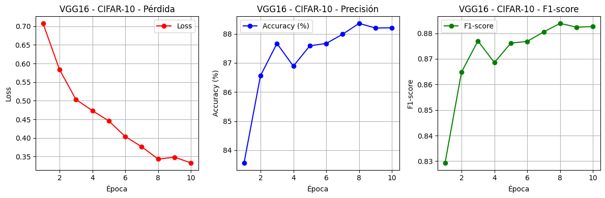
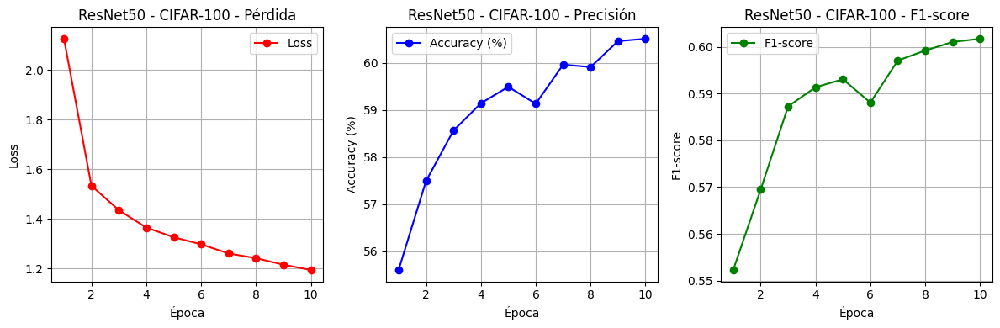
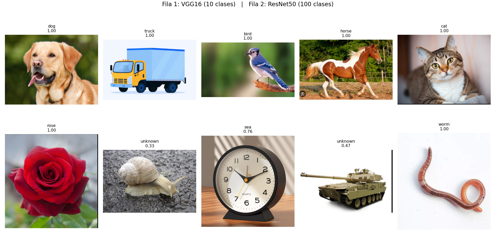
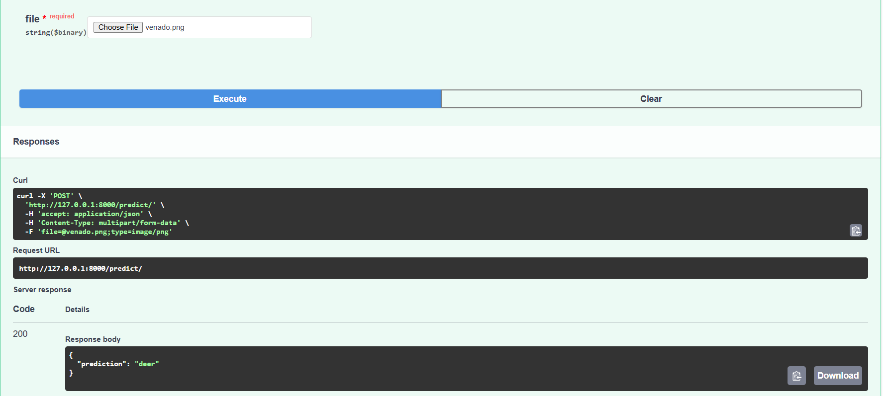

# Taller Transfer Learning – VGG16 y ResNet50

## Descripción general
Este proyecto implementa un flujo completo de aprendizaje profundo aplicado a Visión Computacional, desde el entrenamiento con redes convolucionales preentrenadas (CNNs) hasta la inferencia mediante una API REST con FastAPI.  
El taller aplica Transfer Learning utilizando los modelos **VGG16** y **ResNet50** para clasificar imágenes de los datasets CIFAR-10 y CIFAR-100 respectivamente.

---

## Dataset y explicación
Se emplearon dos datasets clásicos de clasificación de imágenes:

| Dataset | Nº Clases | Tamaño por imagen | Nº Imágenes | Ejemplos de clases |
|----------|------------|------------------|--------------|--------------------|
| **CIFAR-10** | 10 | 32×32 px | 60,000 (50k train, 10k test) | airplane, car, bird, cat, deer, dog, frog, horse, ship, truck |
| **CIFAR-100** | 100 | 32×32 px | 60,000 (50k train, 10k test) | rose, clock, tank, sea, worm, etc. |

Ambos datasets fueron reescalados a 224×224 px para adaptarse a las arquitecturas preentrenadas en *ImageNet*.


---


## Entrenamiento del modelo

### Configuración general
El proceso de entrenamiento se realizó en Google Colab (GPU Tesla T4) usando PyTorch y los modelos preentrenados disponibles en `torchvision.models`.

Durante el entrenamiento:
- Se reemplazó la última capa (`classifier` o `fc`) para adaptarse al número de clases del dataset.
- Se congelaron las capas convolucionales del backbone (transfer learning parcial).
- Se usó una tasa de aprendizaje inicial de 1e-3 y optimizador Adam.
- Épocas: 10
- Tamaño de lote (batch): 64
- Transformaciones: Resize, Normalización y RandomHorizontalFlip para entrenamiento.

**Pesos finales generados:**
modelos/vgg16_cifar10.pth  
modelos/resnet50_cifar100.pth

**Descargar pesos:**  
[VGG16 y ResNet50 – Transfer Learning](https://drive.google.com/drive/folders/1GVKpuzWxfS2GLQF9hEEoRIH-8N4ByZMt)


## Resultados de entrenamiento

### Desempeño de VGG16 – CIFAR-10
| Época | Loss | Accuracy (%) | F1-score |
|--------|------|---------------|-----------|
| 1 | 0.71 | 83.9 | 0.83 |
| 5 | 0.46 | 87.8 | 0.87 |
| 10 | 0.33 | 88.3 | 0.885 |

**Análisis:**
- La pérdida disminuye consistentemente a medida que avanza el entrenamiento.
- El modelo converge rápido gracias al transfer learning desde ImageNet.
- El rendimiento se estabiliza cerca de 88 % de precisión y F1 = 0.88.



---

### Desempeño de ResNet50 – CIFAR-100
| Época | Loss | Accuracy (%) | F1-score |
|--------|------|---------------|-----------|
| 1 | 2.12 | 55.6 | 0.55 |
| 5 | 1.36 | 59.1 | 0.59 |
| 10 | 1.24 | 60.5 | 0.60 |

**Análisis:**
- La pérdida baja de 2.1 a 1.2, indicando aprendizaje estable.
- La precisión mejora de 55 % a 60 %, esperable para un dataset más complejo.
- El F1-score se mantiene en torno a 0.6, con buena estabilidad.



---

## Evaluación y comparación

| Modelo | Dataset | Accuracy | F1-score | Nº Clases | Observaciones |
|---------|----------|-----------|-----------|-------------|---------------|
| **VGG16** | CIFAR-10 | 88.3 % | 0.885 | 10 | Converge rápido, predicciones muy seguras |
| **ResNet50** | CIFAR-100 | 60.5 % | 0.60 | 100 | Más robusto, pero con mayor variabilidad de confianza |


---

## Ejemplos de inferencia

### Predicción con VGG16 y Resnet50



### Análisis de resultados de inferencia

El modelo **VGG16 (10 clases – CIFAR-10)** muestra una consistencia sobresaliente en sus predicciones, clasificando correctamente las todas las imágenes de prueba con una confianza absoluta (1.00). Esto demuestra que el modelo logró aprender representaciones muy discriminantes para categorías con alto contraste visual y poca superposición semántica. 


En cambio, el modelo **ResNet50 (100 clases – CIFAR-100)** evidencia un mayor desafío de generalización, propio de su conjunto de datos más complejo y diverso. Si bien logra identificar con precisión *rose* y *worm* (ambas con confianza 1.00), presenta confusiones visuales en objetos con texturas o patrones similares:  

- La imagen del reloj fue clasificada erróneamente como *sea* (0.76), lo que sugiere que el modelo asocia los tonos y gradientes del fondo con características del mar en CIFAR-100.  
- El caracol y el tanque fueron clasificados como *unknown* (0.33 y 0.47 respectivamente), gracias a la implementación de una función de umbral de confianza (threshold) que marca como desconocido todo objeto cuya predicción no supera un nivel mínimo de certeza. Esta estrategia permite reducir falsos positivos y detectar imágenes fuera de distribución *out-of-distribution*, mejorando la confiabilidad del sistema durante la inferencia.

Aun así, considerando que CIFAR-100 es un dataset diez veces más complejo que CIFAR-10, el modelo ResNet50 muestra un buen aprovechamiento del Transfer Learning, logrando resultados estables en apenas 10 épocas.  
Esto evidencia que la red logró transferir correctamente parte del conocimiento previo de ImageNet, adaptándose de forma efectiva a un nuevo dominio con muchas más categorías y variaciones visuales.


## API de inferencia (FastAPI)


Resultado de ejecución para una imagen de testeo:



### 1. Iniciar el servidor
uvicorn api_inferencia:app --reload

### 2. Acceder desde el navegador
http://127.0.0.1:8000/docs

### 3. Probar el endpoint `/predict/`
Subir una imagen `.jpg` o `.png` y recibir una predicción JSON:
```json
{
  "prediction": "airplane"
}
